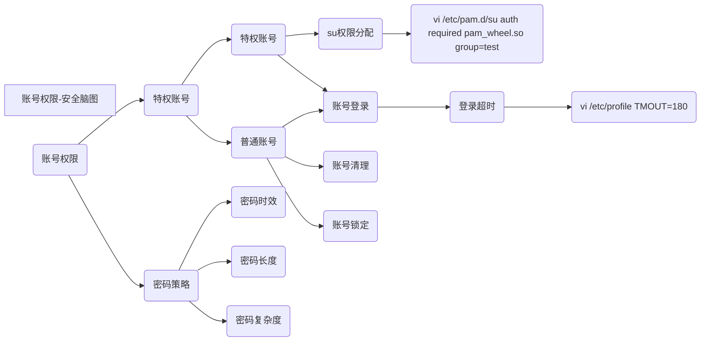
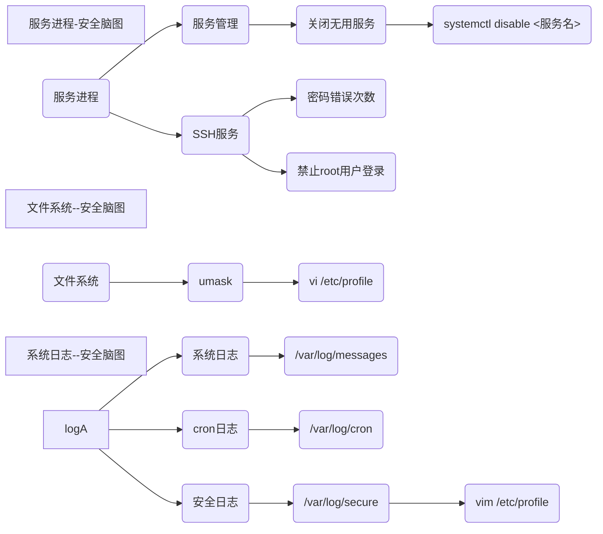

# Linux 安全配置检查表

| 账号口令 |          |      |      |      |      |      |      |
| -------- | -------- | ---- | ---- | ---- | ---- | ---- | ---- |
|          | 特殊账号 |      |      |      |      |      |      |

